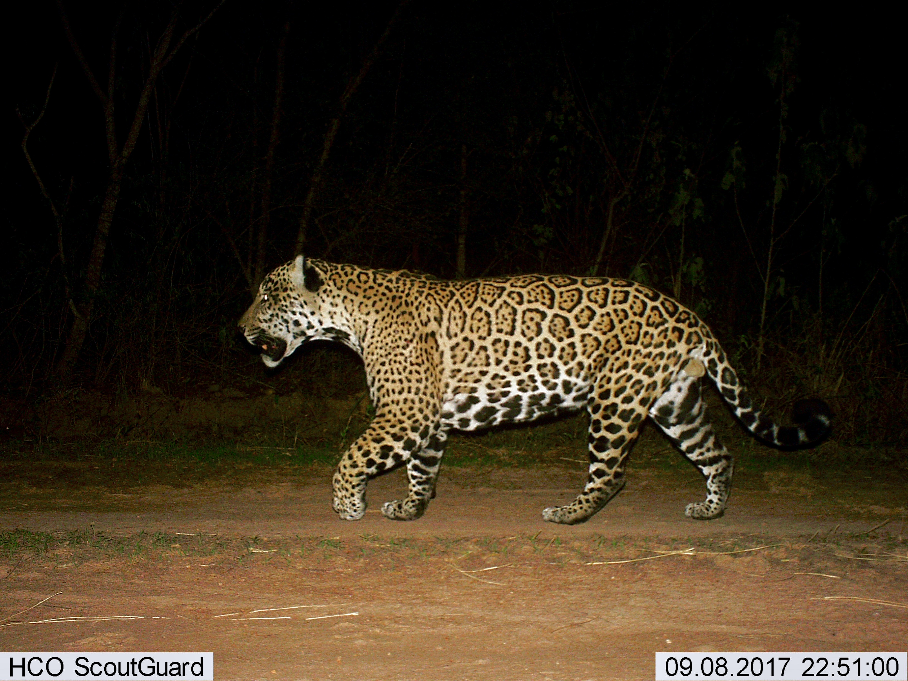

# Hi, I'm Alejandro! 👋

  

I've spent years trying to understand how wildlife populations respond to a changing climate: building Bayesian models on decades of field data, forecasting species viability under uncertainty, and producing evidence that fed directly into conservation decisions. Some of that work meant tracking pumas and jaguars across remote South American landscapes. Some of it meant climbing tropical mountains in the rainforests of northeast Australia to understand how global warming is quietly reshaping the lives of arboreal marsupials in the canopy above. When your model output determines whether a species gets protected, you develop a particular relationship with getting it right.

These days I work at the intersection of AI engineering and data science, building systems that turn messy real-world data into outputs people can act on. I'm particularly drawn to problems where the data is hard, the uncertainty is real, and the answer actually matters. Same instincts, different problems.

- 🔭 Currently working on the Digital Twin project, an AI agent that represent me in professional contexts.
- 🌱 Currently learning MLOps and production systems
- ⚡ Fun fact: I play competitive Magic: The Gathering, a game that rewards the same things I value in modelling: understanding system dynamics, reading signals under uncertainty, and knowing when your model of the game state is wrong.
- 📫 [alejandrofuentepinero@gmail.com](mailto:alejandrofuentepinero@gmail.com) · [LinkedIn](https://www.linkedin.com/in/alejandro-dela-fuente/)

---

## Projects

| Project | Description |
|---|---|
| 🤖 Digital Twin (Upcoming) | An agentic RAG system that represents Alejandro de la Fuente professionally, classifying each recruiter query into one of five branches, dispatching branch-specific retrieval and tools, and gating responses through an independent guardrail agent. |
| 🤖 [AI Job Intelligence Engine](https://github.com/AlejandroFuentePinero/ai-jie) | An LLM-based pipeline that extracts and structures signals from job postings to power data-driven insights for job seekers and labour market analysis. |
| 🤖 [LLM Engineering Lab](https://github.com/AlejandroFuentePinero/llm-engineering-lab) | A growing collection of LLM projects built from scratch: fine-tuning open-source and frontier models, RAG systems with evaluation, and autonomous agents that plan and act. |
| 📊 [Job Intelligence Engine](https://github.com/AlejandroFuentePinero/job-intelligence-engine) | A job recommender and upskilling system built on tech job market structure. Surfaces top job recommendations, salary signals, skill gaps, and what to learn next. |
| 📊 [MLB Analytics with SQL](https://github.com/AlejandroFuentePinero/MLB_Analytics_Project) | 150 years of baseball run through a clean relational schema. Analytics on talent pipelines, salary dynamics, and player careers. |
| 🧪 [Python OOP Mini Systems](https://github.com/AlejandroFuentePinero/python-oop-mini-systems) | Small systems built to practice object-oriented design, from procedural scripts to clean class hierarchies. |
| 🧪 [Python EDA Mini Projects](https://github.com/AlejandroFuentePinero/python-eda-mini-projects) | Applied EDA on real datasets, working through wrangling, feature extraction, and visual storytelling. |
| 🧪 [Python ML Projects](https://github.com/AlejandroFuentePinero/python-ML-projects) | Core ML algorithms implemented and applied, from regression and classification to clustering and deep learning. |
| 🎲 [MTG Mana Calculator](https://github.com/AlejandroFuentePinero/mtg-mana-calculator) | A browser tool for Magic: The Gathering players to calculate optimal land counts and colour sources using Frank Karsten's heuristics. Because even card games deserve a rigorous model. |

---

## 🎓 Academic Work

Peer-reviewed modelling and research spanning Bayesian inference, spatiotemporal forecasting, and climate-change science.

[Academic portfolio](https://alejandrofuentepinero.github.io/academic/) · [Google Scholar](https://scholar.google.com.au/citations?user=7CKVdZwAAAAJ&hl=en)
