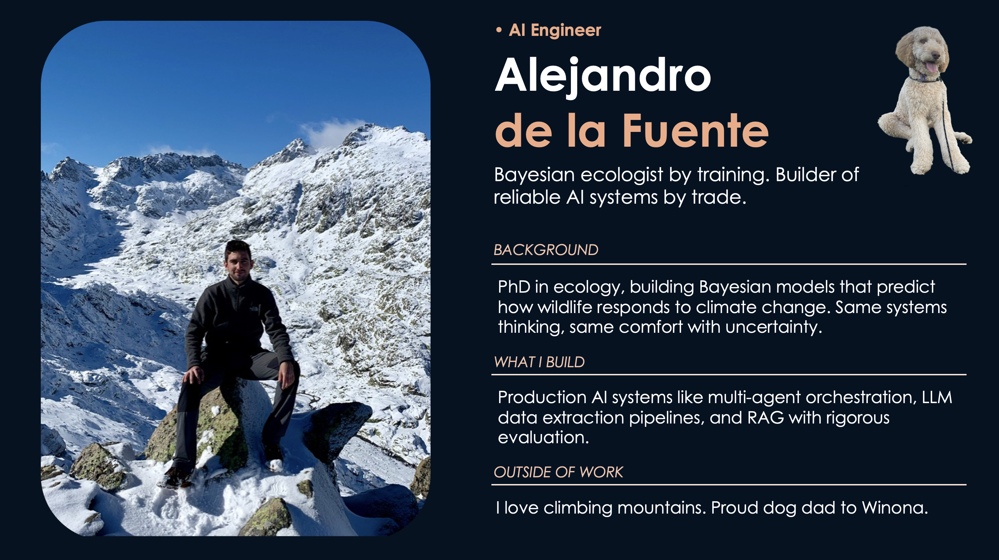

  

## Current Projects

- 🪞 **[Digital Twin](https://github.com/AlejandroFuentePinero/digital-twin)** — Agentic RAG system that answers professional questions about me: experience, research, projects, career trajectory.
- 🛰️ **[AI Job Intelligence Engine](https://github.com/AlejandroFuentePinero/ai-jie)** — LLM extraction pipeline turning messy job postings into structured signals.
- 🧪 **[LLM Engineering Lab](https://github.com/AlejandroFuentePinero/llm-engineering-lab)** — Collection of LLM projects from scratch.
- 🧭 **[Job Intelligence Engine](https://github.com/AlejandroFuentePinero/job-intelligence-engine)** — Job recommender and upskilling system.
- ⚾ **[MLB Analytics with SQL](https://github.com/AlejandroFuentePinero/MLB_Analytics_Project)** — Analytics on talent pipelines, salary dynamics, and player careers.
- 🧠 **[Python ML Projects](https://github.com/AlejandroFuentePinero/python-ML-projects)** — Core ML algorithms implemented and applied.
- 🔍 **[Python EDA Mini Projects](https://github.com/AlejandroFuentePinero/python-eda-mini-projects)** — Applied EDA on real datasets.
- 🧱 **[Python OOP Mini Systems](https://github.com/AlejandroFuentePinero/python-oop-mini-systems)** — Small systems for practising object-oriented design.
- 🎴 **[MTG Mana Calculator](https://github.com/AlejandroFuentePinero/mtg-mana-calculator)** — Optimal mana base calculator for MTG.

## Academic Work

Peer-reviewed modelling and research spanning Bayesian inference, spatiotemporal forecasting, and climate-change science.

## Connect

